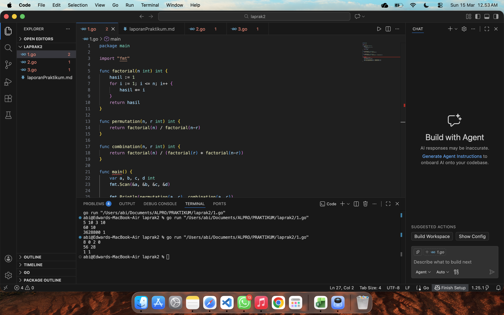
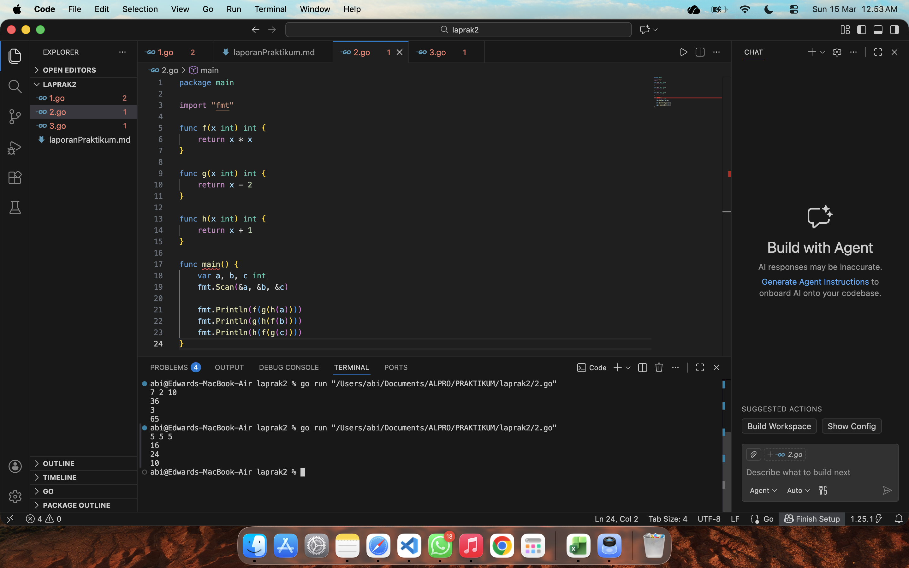
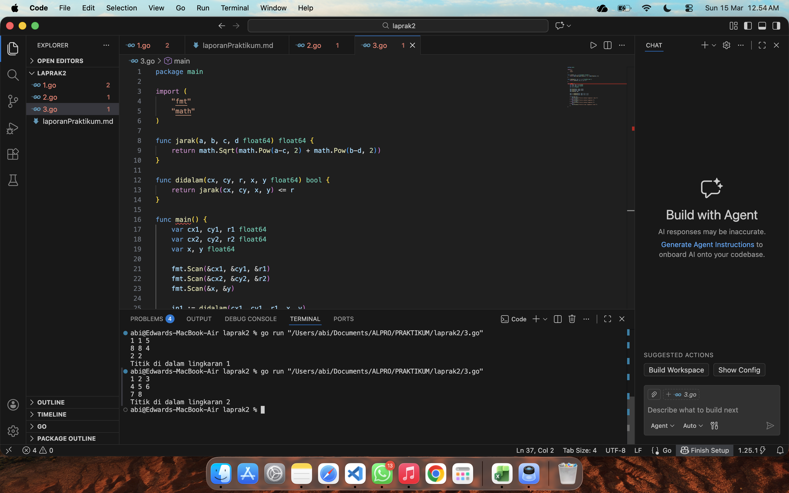

# <h1 align="center">Laporan Praktikum Modul 3 - FUNGSI </h1>
<p align="center">[EDWARD ABIMAS SURYA HATTA] - [109082500171]</p>

## Unguided 

### 1. [Menghitung Permutasi dan Kombinasi]
#### soal1.go

```go
package main

import "fmt"

func factorial(n int) int {
	hasil := 1
	for i := 1; i <= n; i++ {
		hasil *= i
	}
	return hasil
}

func permutation(n, r int) int {
	return factorial(n) / factorial(n-r)
}

func combination(n, r int) int {
	return factorial(n) / (factorial(r) * factorial(n-r))
}

func main() {
	var a, b, c, d int
	fmt.Scan(&a, &b, &c, &d)

	fmt.Println(permutation(a, c), combination(a, c))
	fmt.Println(permutation(b, d), combination(b, d))
}
```
### Output Unguided :

##### Output 

[Program ini dibuat untuk menghitung nilai permutasi dan kombinasi dari dua pasang bilangan yang dimasukkan oleh pengguna. Sesuai dengan materi di modul, kita memecah logika program ini menjadi tiga subprogram atau fungsi pendukung. Fungsi pertama bertugas mencari nilai faktorial dari sebuah angka secara berulang. Selanjutnya, fungsi kedua dan ketiga masing-masing digunakan untuk menghitung nilai permutasi dan kombinasi. Alih-alih menulis ulang perhitungan yang panjang, kedua fungsi ini langsung memanfaatkan pemanggilan fungsi faktorial yang sudah kita buat di awal. Pada bagian utama program, kita hanya perlu menampung empat angka yang diketikkan pengguna , lalu mencetak hasil akhir permutasi dan kombinasi ke layar sesuai dengan format baris yang diminta.]

### 2. [Menghitung Komposisi Fungsi]
#### soal2.go

```go
package main

import "fmt"

func f(x int) int {
	return x * x
}

func g(x int) int {
	return x - 2
}

func h(x int) int {
	return x + 1
}

func main() {
	var a, b, c int
	fmt.Scan(&a, &b, &c)

	fmt.Println(f(g(h(a))))
	fmt.Println(g(h(f(b))))
	fmt.Println(h(f(g(c))))
}
```
### Output Unguided :

##### Output 

[Program kedua ini mengimplementasikan konsep komposisi fungsi matematika ke dalam bentuk kode pemrograman. Berdasarkan petunjuk soal, kita menerjemahkan tiga fungsi matematika dasar menjadi tiga fungsi mandiri di dalam bahasa Go. Fungsi pertama digunakan untuk mengkuadratkan sebuah nilai, fungsi kedua untuk mengurangi sebuah nilai dengan angka dua, dan fungsi ketiga untuk menambahkan sebuah nilai dengan angka satu. Untuk menyelesaikan masalah komposisi fungsi, kita menerapkan teknik pemanggilan fungsi secara bersarang atau bertumpuk. Di dalam program utama, setelah sistem menerima masukan tiga buah angka dari pengguna, proses komputasi akan berjalan dari fungsi yang posisinya paling dalam. Hasil komputasi dari fungsi terdalam tersebut otomatis diteruskan ke fungsi yang membungkusnya di luar, begitu seterusnya hingga mendapatkan nilai akhir untuk ditampilkan ke layar menjadi tiga baris keluaran.]

### 3. [Menentukan Posisi Titik terhadap Lingkaran]
#### soal3.go

```go
package main

import (
	"fmt"
	"math"
)

func jarak(a, b, c, d float64) float64 {
	return math.Sqrt(math.Pow(a-c, 2) + math.Pow(b-d, 2))
}

func didalam(cx, cy, r, x, y float64) bool {
	return jarak(cx, cy, x, y) <= r
}

func main() {
	var cx1, cy1, r1 float64
	var cx2, cy2, r2 float64
	var x, y float64

	fmt.Scan(&cx1, &cy1, &r1)
	fmt.Scan(&cx2, &cy2, &r2)
	fmt.Scan(&x, &y)

	in1 := didalam(cx1, cy1, r1, x, y)
	in2 := didalam(cx2, cy2, r2, x, y)

	if in1 && in2 {
		fmt.Println("Titik di dalam lingkaran 1 dan 2")
	} else if in1 {
		fmt.Println("Titik di dalam lingkaran 1")
	} else if in2 {
		fmt.Println("Titik di dalam lingkaran 2")
	} else {
		fmt.Println("Titik di luar lingkaran 1 dan 2")
	}
}
```
### Output Unguided :

##### Output 

[Program terakhir ini bertujuan untuk mendeteksi posisi sebuah titik sembarang terhadap dua buah lingkaran yang sudah diketahui koordinat pusat dan ukuran radiusnya. Penyelesaian masalah ini dipecah ke dalam dua fungsi khusus. Fungsi pertama bertugas menghitung jarak lurus antara dua buah koordinat. Untuk mendapatkan hasil yang akurat, fungsi ini menggunakan bantuan paket matematika bawaan dari bahasa Go untuk mengeksekusi proses akar kuadrat. Kemudian, fungsi kedua bekerja dengan cara memanggil fungsi perhitungan jarak tadi untuk menguji apakah jarak dari titik sembarang ke pusat lingkaran masih kurang dari atau sama dengan batas ukuran radiusnya. Jika memenuhi syarat tersebut, berarti titik itu dipastikan berada di dalam area lingkaran. Pada bagian jalannya program utama, sistem akan membaca dan menyimpan semua data koordinat yang diketik menjadi tiga baris, lalu melakukan pengecekan satu per satu pada kedua lingkaran. Terakhir, program menggunakan percabangan logika untuk menyeleksi kondisi mana yang terpenuhi, lalu menampilkan kalimat status yang paling tepat sesuai posisi titiknya.]