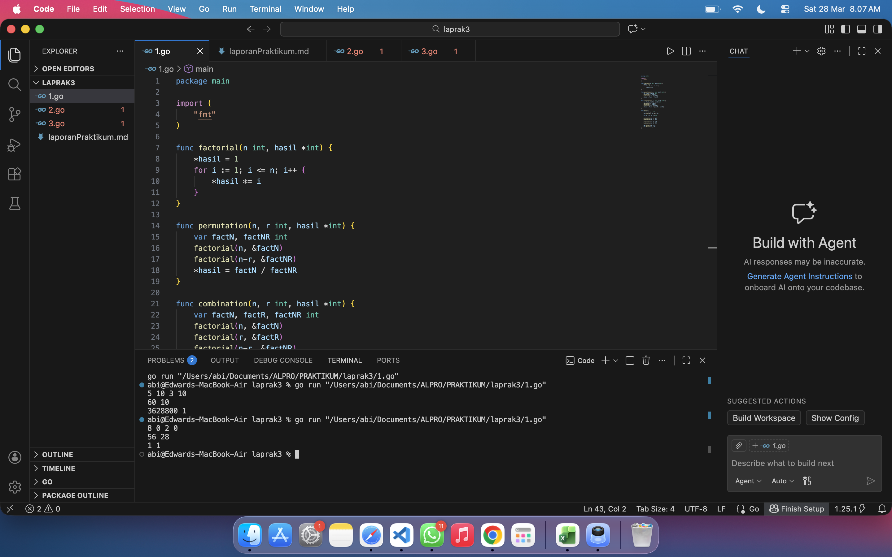
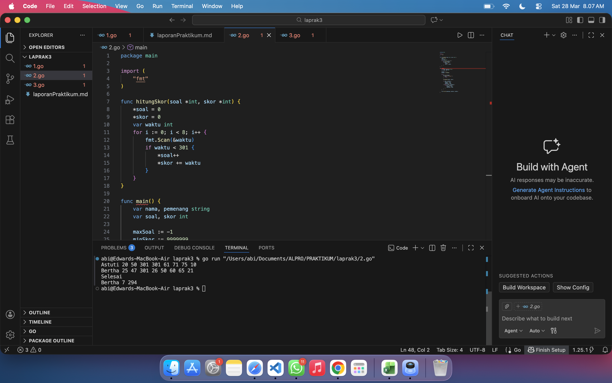

# <h1 align="center">Laporan Praktikum Modul 4 - Prosedur - ... </h1>
<p align="center">EDWARD ABIMAS SURYA HATTA - 109082500171</p>

## Unguided 

### 1. Minggu ini, mahasiswa Fakultas Informatika mendapatkan tugas dari mata kuliah matematika diskrit untuk mempelajari kombinasi dan permutasi. Jonas salah seorang mahasiswa, iseng untuk mengimplementasikannya ke dalam suatu program. Oleh karena itu bersediakah kalian membantu Jonas? (tidak tentunya ya :p) Masukan terdiri dari empat buah bilangan asli a, b, c, dan d yang dipisahkan oleh spasi, dengan syarat a >= c dan b >= d. Keluaran terdiri dari dua baris. Baris pertama adalah hasil permutasi dan kombinasi a terhadap c, sedangkan baris kedua adalah hasil permutasi dan kombinasi b terhadap d. Catatan: permutasi (P) dan kombinasi (C) dari n terhadap r (n >= r) dapat dihitung dengan menggunakan persamaan berikut: P(n,r) = n! / (n-r)!, sedangkan C(n,r) = n! / (r!(n-r)!).

#### 1.go

```go
package main

import (
	"fmt"
)

func factorial(n int, hasil *int) {
	*hasil = 1
	for i := 1; i <= n; i++ {
		*hasil *= i
	}
}

func permutation(n, r int, hasil *int) {
	var factN, factNR int
	factorial(n, &factN)
	factorial(n-r, &factNR)
	*hasil = factN / factNR
}

func combination(n, r int, hasil *int) {
	var factN, factR, factNR int
	factorial(n, &factN)
	factorial(r, &factR)
	factorial(n-r, &factNR)
	*hasil = factN / (factR * factNR)
}

func main() {
	var a, b, c, d int
	fmt.Scan(&a, &b, &c, &d)

	var p1, c1, p2, c2 int

	permutation(a, c, &p1)
	combination(a, c, &c1)

	permutation(b, d, &p2)
	combination(b, d, &c2)

	fmt.Println(p1, c1)
	fmt.Println(p2, c2)
}
```
### Output Unguided :

##### Output 

Program ini dibangun dengan pendekatan modular menggunakan prosedur yang diimplementasikan sebagai fungsi dengan pelewatan parameter berdasarkan referensi menggunakan pointer di Golang untuk mensimulasikan parameter in/out yang diminta pada soal. Pada prosedur faktorial, program menerima nilai bilangan bulat positif dan sebuah pointer hasil yang nilai awalnya diubah menjadi satu, kemudian menggunakan perulangan untuk mengalikan nilai tersebut dengan angka berurutan dari satu hingga batas nilai masukan sehingga menghasilkan nilai faktorial murni. Selanjutnya, prosedur permutasi dan kombinasi bertugas memanggil prosedur faktorial secara berulang kali dengan mengirimkan alamat memori variabel penampung sementara untuk mendapatkan nilai faktorial dari parameter n, r, maupun selisih n dan r. Setelah nilai-nilai faktorial tersebut didapatkan dari prosedur pemanggil, prosedur permutasi dan kombinasi langsung menerapkan operasi pembagian sesuai dengan rumus matematis yang telah didefinisikan untuk memperbarui nilai parameter hasil. Pada program utama, setelah sistem membaca empat variabel masukan yang masing-masing dipisahkan oleh spasi, sistem secara berurutan mengeksekusi prosedur untuk menghitung permutasi dan kombinasi dari dua pasang angka masukan tersebut lalu langsung mencetak nilainya ke layar dengan membaginya ke dalam dua baris keluaran yang rapi.

### 2. Kompetisi pemrograman tingkat nasional berlangsung ketat. Setiap peserta diberikan 8 soal yang harus dapat diselesaikan dalam waktu 5 jam saja. Peserta yang berhasil menyelesaikan soal paling banyak dalam waktu paling singkat adalah pemenangnya. Buat program gema yang mencari pemenang dari daftar peserta yang diberikan. Program harus dibuat modular, yaitu dengan membuat prosedur hitungSkor yang mengembalikan total soal dan total skor yang dikerjakan oleh seorang peserta, melalui parameter formal. Pembacaan nama peserta dilakukan di program utama, sedangkan waktu pengerjaan dibaca di dalam prosedur. Setiap baris masukan dimulai dengan satu string nama peserta tersebut diikuti dengan 8 integer yang menyatakan berapa lama (dalam menit) peserta tersebut menyelesaikan soal. Jika tidak berhasil atau tidak mengirimkan jawaban maka otomatis dianggap menyelesaikan dalam waktu 5 jam 1 menit (301 menit). Satu baris keluaran berisi nama pemenang, jumlah soal yang diselesaikan, dan nilai yang diperoleh. Nilai adalah total waktu yang dibutuhkan untuk menyelesaikan soal yang berhasil diselesaikan.

#### 2.go

```go
package main

import (
	"fmt"
)

func hitungSkor(soal *int, skor *int) {
	*soal = 0
	*skor = 0
	var waktu int
	for i := 0; i < 8; i++ {
		fmt.Scan(&waktu)
		if waktu < 301 {
			*soal++
			*skor += waktu
		}
	}
}

func main() {
	var nama, pemenang string
	var soal, skor int

	maxSoal := -1
	minSkor := 9999999 

	for {
		fmt.Scan(&nama)
		if nama == "Selesai" {
			break
		}

		hitungSkor(&soal, &skor)

		if soal > maxSoal {
			maxSoal = soal
			minSkor = skor
			pemenang = nama
		} else if soal == maxSoal {
			if skor < minSkor {
				minSkor = skor
				pemenang = nama
			}
		}
	}

	fmt.Println(pemenang, maxSoal, minSkor)
}
```
### Output Unguided :

##### Output 

Logika penyelesaian masalah ini sangat bergantung pada pembagian tugas antara program utama dan sub-program seperti yang telah disyaratkan secara ketat oleh deskripsi permasalahan. Program utama bertugas menginisialisasi variabel penyimpanan rekor tertinggi yang nilai awalnya dibuat sangat ekstrem agar mudah digantikan oleh data peserta pertama, sekaligus melakukan perulangan tak terbatas untuk terus membaca nama peserta hingga sistem menemukan kata kunci Selesai yang menghentikan proses pembacaan data. Setiap kali nama valid terbaca, program utama segera memanggil prosedur hitungSkor yang secara internal akan melakukan perulangan sebanyak tepat delapan kali untuk membaca durasi pengerjaan masing-masing soal dari saluran masukan standar. Di dalam prosedur pembacaan skor tersebut, program secara otomatis akan mengabaikan waktu pengerjaan yang bernilai di atas batas toleransi yaitu 301 menit karena nilai tersebut dianggap sebagai penanda bahwa peserta gagal atau tidak mengirimkan jawaban, sementara nilai yang valid akan ditambahkan ke total waktu akumulatif dan memicu penambahan jumlah soal yang berhasil dipecahkan. Begitu eksekusi kembali ke program utama, algoritma langsung membandingkan skor peserta saat ini dengan rekor sementara untuk memperbarui gelar pemenang beserta detail skornya apabila peserta baru tersebut menyelesaikan soal lebih banyak, atau apabila ia memecahkan soal dalam jumlah yang sama namun memiliki total akumulasi waktu pengerjaan yang lebih efisien.

### 3. Skiena dan Revilla dalam Programming Challenges mendefinisikan sebuah deret bilangan. Deret dimulai dengan sebuah bilangan bulat n. Jika bilangan n saat itu genap, maka suku berikutnya adalah n/2, tetapi jika ganjil maka suku berikutnya bernilai 3n+1. Rumus yang sama digunakan terus menerus untuk mencari suku berikutnya. Deret berakhir ketika suku terakhir bernilai 1. Sebagai contoh jika dimulai dengan n=22, maka deret bilangan yang diperoleh adalah: 22 11 34 17 52 26 13 40 20 10 5 16 8 4 2 1. Untuk suku awal sampai dengan 1000000, diketahui deret selalu mencapai suku dengan nilai 1. Buat program skiena yang akan mencetak setiap suku dari deret yang dijelaskan di atas untuk nilai suku awal yang diberikan. Pencetakan deret harus dibuat dalam prosedur cetakDeret yang mempunyai 1 parameter formal, yaitu nilai dari suku awal. Masukan berupa satu bilangan integer positif yang lebih kecil dari 1000000. Keluaran terdiri dari satu baris saja. Setiap suku dari deret tersebut dicetak dalam baris yang dan dipisahkan oleh sebuah spasi.

#### 3.go

```go
package main

import (
	"fmt"
)

func cetakDeret(n int) {
	for n != 1 {
		fmt.Print(n, " ")
		if n%2 == 0 {
			n = n / 2
		} else {
			n = 3*n + 1
		}
	}
	fmt.Println(1)
}

func main() {
	var n int
	fmt.Scan(&n)
	cetakDeret(n)
}
```
### Output Unguided :

##### Output 

Penyelesaian algoritma ini difokuskan sepenuhnya di dalam sebuah prosedur tunggal bernama cetakDeret yang bekerja menerima sebuah argumen nilai suku awal bertipe bilangan bulat positif dari program utama. Prosedur ini diotaki oleh sebuah struktur perulangan kondisional yang dirancang untuk terus berjalan selama nilai parameter numerik tersebut tidak sama dengan satu yang merupakan titik henti mutlak dari deret tersebut. Pada setiap iterasi di dalam perulangan tersebut, program senantiasa mencetak nilai suku saat itu ke layar beserta sebuah spasi pemisah sebelum masuk ke tahap evaluasi logika percabangan. Logika percabangan menggunakan operasi modulus untuk mendeteksi apakah nilai saat ini bisa dibagi habis oleh dua yang menandakannya sebagai bilangan genap sehingga nilai tersebut perlu diperbarui menjadi setengah dari nilai aslinya, sedangkan jika nilai tersebut ternyata menyisakan pembagian yang berarti ganjil maka program akan mengalikannya dengan tiga dan menjumlahkannya dengan satu. Proses evaluasi dan pencetakan ini berulang secara otomatis mengikuti aliran nilai baru yang terus bermutasi, dan begitu algoritma mendeteksi nilai akhirnya menyentuh angka satu perulangan dihentikan secara sekuensial lalu program mencetak angka satu tersebut diakhiri dengan perpindahan baris baru untuk merapikan format keluaran sistem.
