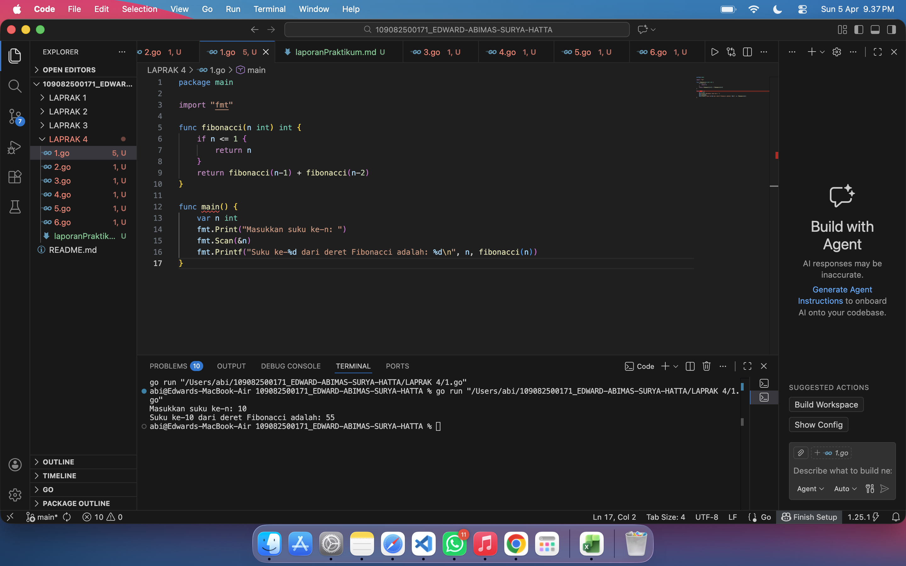
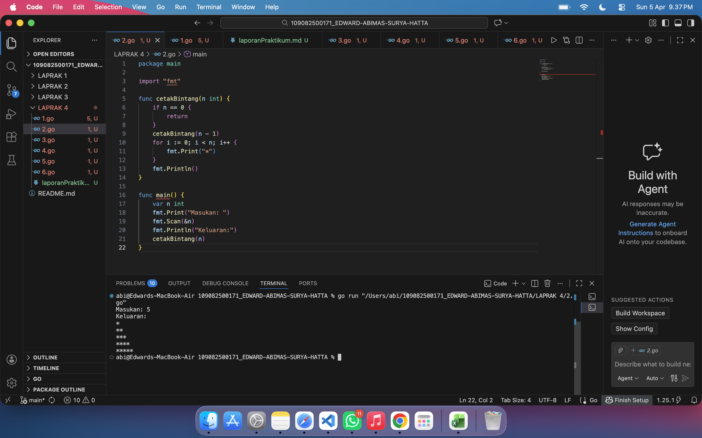
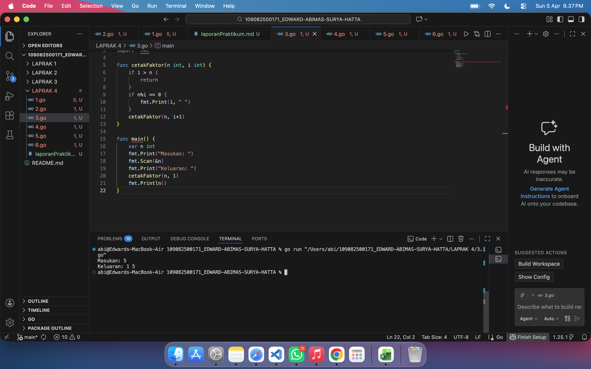
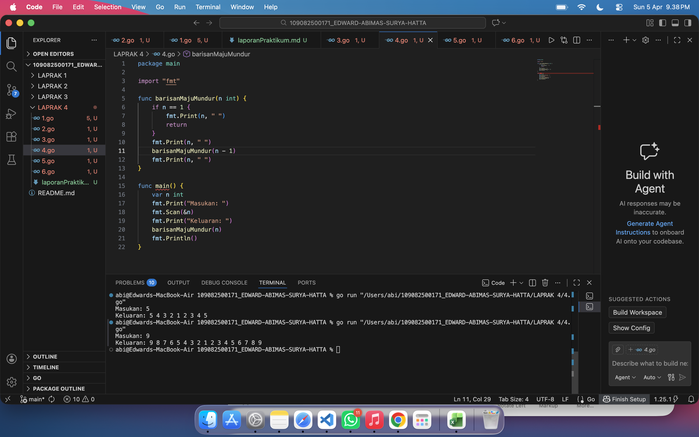
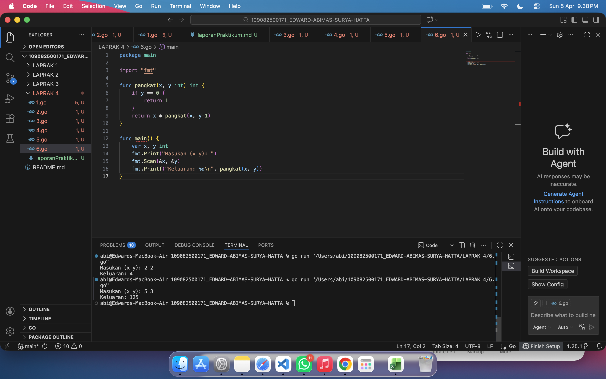

# <h1 align="center">Laporan Praktikum Modul 5 - Rekursif </h1>
<p align="center">[EDWARD ABIMAS SURYA HATTA] - [109082500171]</p>

## Unguided 

### 1. Deret fibonacci adalah sebuah deret dengan nilai suku ke-0 dan ke-1 adalah 0 dan 1, dan nilai suku ke-n selanjutnya adalah hasil penjumlahan dua suku sebelumnya. Buatlah program yang mengimplementasikan fungsi rekursif pada deret fibonacci tersebut.
#### soal1.go

```go
package main

import "fmt"

func fibonacci(n int) int {
	if n <= 1 {
		return n
	}
	return fibonacci(n-1) + fibonacci(n-2)
}

func main() {
	var n int
	fmt.Print("Masukkan suku ke-n: ")
	fmt.Scan(&n)
	fmt.Printf("Suku ke-%d dari deret Fibonacci adalah: %d\n", n, fibonacci(n))
}
```
### Output Unguided :

##### Output 

Program di atas dirancang untuk mencari nilai dari suku ke-n pada deret Fibonacci dengan memanfaatkan teknik fungsi rekursif. Fungsi utama yang menangani perhitungan ini menerima satu parameter bilangan bulat yang merepresentasikan urutan suku yang dicari. Di dalam fungsi tersebut, terdapat kondisi basis yang menghentikan pemanggilan berulang, yaitu ketika nilai parameter kurang dari atau sama dengan satu, maka fungsi akan langsung mengembalikan nilai parameter itu sendiri. Jika nilai parameter lebih dari satu, fungsi akan memanggil dirinya sendiri sebanyak dua kali untuk menghitung nilai suku n-1 dan n-2, lalu menjumlahkan kedua hasil pemanggilan tersebut untuk mendapatkan nilai suku saat ini sesuai dengan aturan deret Fibonacci.

### 2. Buatlah sebuah program yang digunakan untuk menampilkan pola bintang bertingkat dengan menggunakan fungsi rekursif. N adalah masukan dari user.
#### soal2.go

```go
package main

import "fmt"

func cetakBintang(n int) {
	if n == 0 {
		return
	}
	cetakBintang(n - 1)
	for i := 0; i < n; i++ {
		fmt.Print("*")
	}
	fmt.Println()
}

func main() {
	var n int
	fmt.Print("Masukan: ")
	fmt.Scan(&n)
	fmt.Println("Keluaran:")
	cetakBintang(n)
}
```
### Output Unguided :

##### Output 

Program ini berfungsi untuk mencetak pola bintang yang jumlahnya terus bertambah setiap barisnya dari satu hingga mencapai batas yang ditentukan oleh pengguna. Logika utamanya terletak pada penempatan pemanggilan fungsi rekursif yang diletakkan sebelum instruksi perulangan untuk mencetak bintang. Ketika fungsi dipanggil dengan suatu nilai, program akan terus memanggil fungsi tersebut dengan nilai yang terus berkurang hingga mencapai angka nol sebagai kondisi berhentinya. Setelah kondisi berhenti tercapai, program akan kembali memproses tumpukan pemanggilan fungsi dari yang terkecil, sehingga bintang tercetak mulai dari satu buah di baris pertama dan terus bertambah sesuai dengan nilai parameter pada setiap tingkat pemanggilan sebelumnya.

### 3. Buatlah program yang mengimplementasikan rekursif untuk menampilkan faktor bilangan dari suatu N, atau bilangan apa saja yang habis membagi N. Masukan terdiri dari sebuah bilangan bulat positif N. Keluaran terdiri dari barisan bilangan yang menjadi faktor dari N secara terurut.
#### soal3.go

```go
package main

import "fmt"

func cetakFaktor(n int, i int) {
	if i > n {
		return
	}
	if n%i == 0 {
		fmt.Print(i, " ")
	}
	cetakFaktor(n, i+1)
}

func main() {
	var n int
	fmt.Print("Masukan: ")
	fmt.Scan(&n)
	fmt.Print("Keluaran: ")
	cetakFaktor(n, 1)
	fmt.Println()
}
```
### Output Unguided :

##### Output 

Program ini bertujuan untuk mencari dan mencetak semua bilangan yang merupakan faktor dari bilangan yang dimasukkan oleh pengguna menggunakan pendekatan rekursif. Fungsi pencari faktor menggunakan dua buah parameter, yaitu bilangan utama yang ingin dicari faktornya dan sebuah nilai penghitung yang selalu diawali dengan angka satu. Di dalam fungsi, program akan memeriksa apakah bilangan utama habis dibagi dengan nilai penghitung saat ini dengan menggunakan operasi sisa bagi. Jika habis dibagi, maka nilai penghitung tersebut akan dicetak ke layar sebagai faktor. Setelah pemeriksaan selesai, fungsi akan memanggil dirinya sendiri dengan meningkatkan nilai penghitung sebanyak satu angka, dan proses ini akan terus berulang hingga nilai penghitung melebihi batas bilangan utama yang diperiksa.

### 4. Buatlah program yang mengimplementasikan rekursif untuk menampilkan barisan bilangan tertentu. Masukan terdiri dari sebuah bilangan bulat positif N. Keluaran terdiri dari barisan bilangan dari N hingga 1 dan kembali ke N.
#### soal4.go

```go
package main

import "fmt"

func barisanMajuMundur(n int) {
	if n == 1 {
		fmt.Print(n, " ")
		return
	}
	fmt.Print(n, " ")
	barisanMajuMundur(n - 1)
	fmt.Print(n, " ")
}

func main() {
	var n int
	fmt.Print("Masukan: ")
	fmt.Scan(&n)
	fmt.Print("Keluaran: ")
	barisanMajuMundur(n)
	fmt.Println()
}
```
### Output Unguided :

##### Output 

Program ini menampilkan sebuah barisan bilangan yang dicetak secara menurun dari angka masukan hingga mencapai angka satu, dan kemudian dilanjutkan secara menaik kembali ke angka masukan semula. Hal ini dapat dicapai berkat sifat pergerakan maju dan mundur pada eksekusi fungsi rekursif. Ketika fungsi dijalankan, program pertama-tama akan mencetak angka saat ini sebelum memanggil kembali dirinya sendiri dengan angka yang dikurangi satu, yang menghasilkan urutan menurun. Kondisi berhentinya adalah ketika angka mencapai satu, di mana program hanya akan mencetak angka satu tersebut dan menghentikan pemanggilan lebih lanjut. Saat program kembali menyelesaikan tumpukan pemanggilan fungsi yang tertunda, perintah cetak kedua yang berada di bawah pemanggilan fungsi akan dieksekusi, sehingga menghasilkan urutan bilangan yang menaik.

### 5. Buatlah program yang mengimplementasikan rekursif untuk menampilkan barisan bilangan ganjil. Masukan terdiri dari sebuah bilangan bulat positif N. Keluaran terdiri dari barisan bilangan ganjil dari 1 hingga N.
#### soal5.go

```go
package main

import "fmt"

func cetakGanjil(n int, i int) {
	if i > n {
		return
	}
	if i%2 != 0 {
		fmt.Print(i, " ")
	}
	cetakGanjil(n, i+1)
}

func main() {
	var n int
	fmt.Print("Masukan: ")
	fmt.Scan(&n)
	fmt.Print("Keluaran: ")
	cetakGanjil(n, 1)
	fmt.Println()
}
```
### Output Unguided :

##### Output 

Program ini berfungsi untuk mencetak semua bilangan ganjil mulai dari angka satu hingga mencapai batas angka yang diinputkan oleh pengguna. Cara kerjanya serupa dengan pencarian faktor bilangan, yaitu menggunakan fungsi rekursif yang membawa parameter batas akhir dan nilai penghitung awal sebesar satu. Pada setiap siklus pemanggilan, program menggunakan operasi sisa bagi dua untuk memastikan apakah nilai penghitung saat ini merupakan bilangan ganjil atau tidak. Apabila hasilnya tidak sama dengan nol, maka angka tersebut dicetak. Setelah evaluasi tersebut, fungsi dipanggil ulang secara terus menerus dengan nilai penghitung yang bertambah satu setiap kalinya, dan proses akan berhenti total ketika nilai penghitung sudah lebih besar dari angka masukan.

### 6. Buatlah program yang mengimplementasikan rekursif untuk mencari hasil pangkat dari dua buah bilangan. Masukan terdiri dari bilangan bulat x dan y. Keluaran terdiri dari hasil x dipangkatkan y. Diperbolehkan menggunakan asterik "*", tapi dilarang menggunakan import "math".
#### soal6.go

```go
package main

import "fmt"

func pangkat(x, y int) int {
	if y == 0 {
		return 1
	}
	return x * pangkat(x, y-1)
}

func main() {
	var x, y int
	fmt.Print("Masukan (x y): ")
	fmt.Scan(&x, &y)
	fmt.Printf("Keluaran: %d\n", pangkat(x, y))
}
```
### Output Unguided :

##### Output 

Program ini dirancang untuk menghitung hasil perpangkatan dari suatu bilangan dasar terhadap nilai pangkatnya tanpa menggunakan pustaka matematika bawaan, melainkan murni mengandalkan logika perkalian berulang melalui fungsi rekursif. Fungsi pangkat menerima dua nilai, yakni angka basis dan angka eksponen. Kondisi penghenti atau basis rekursinya ditetapkan ketika angka pangkat menyentuh angka nol, di mana fungsi diwajibkan mengembalikan nilai satu karena bilangan apapun yang dipangkatkan nol akan selalu bernilai satu. Jika pangkat masih berupa bilangan bulat positif, fungsi akan mengalikan nilai basis dengan hasil pemanggilan fungsi itu sendiri di mana parameter pangkat dikurangi dengan satu, sehingga operasi perkalian akan terus terakumulasi hingga nilai pangkat habis.

