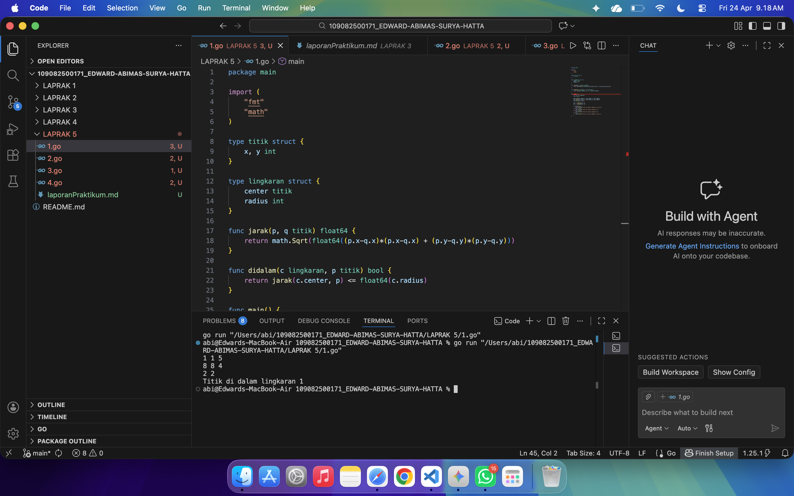
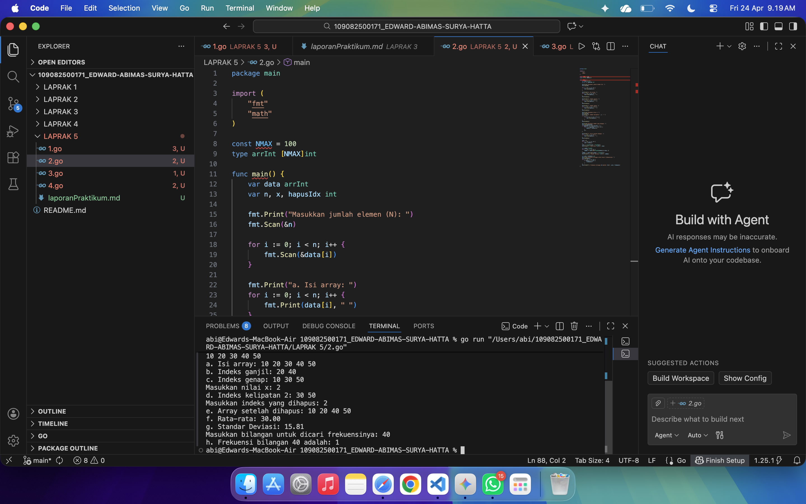
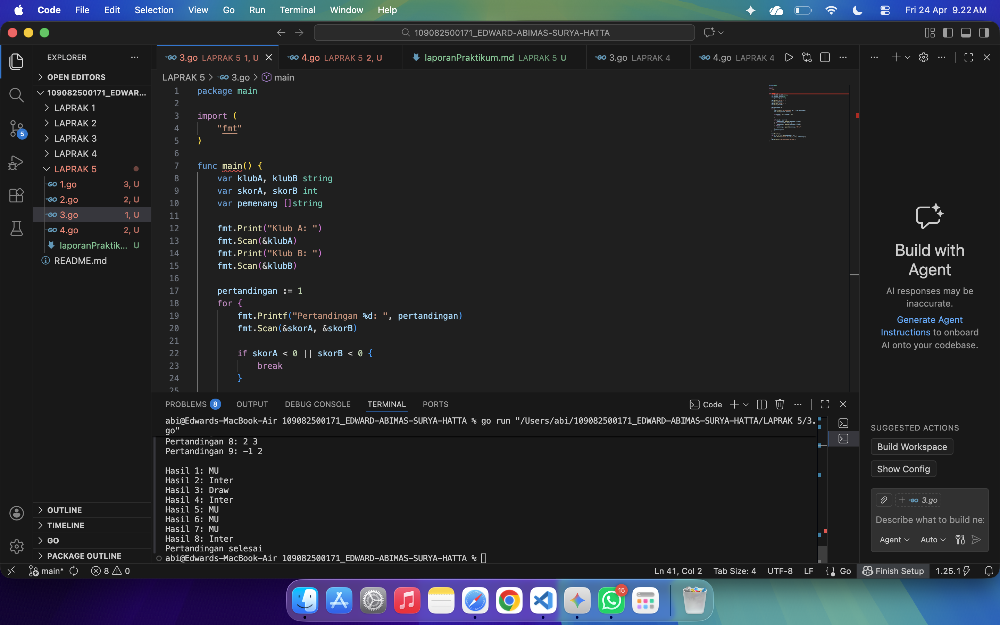
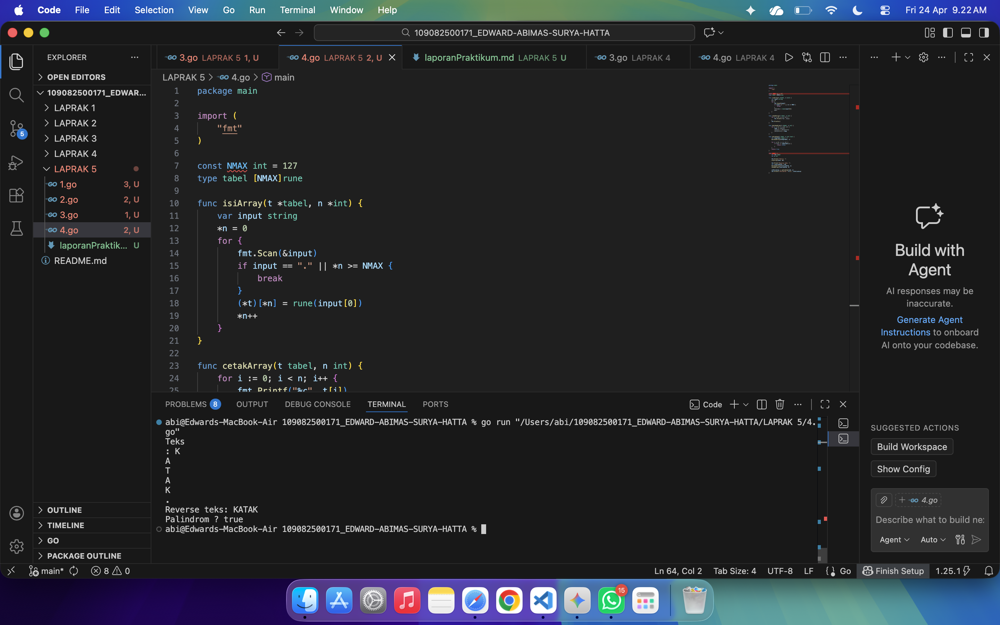

# <h1 align="center">Laporan Praktikum Modul 9 - ARRAY </h1>
<p align="center">EDWARD ABIMAS SURYA HATTA - 109082500171</p>

## Unguided 

### 1. Suatu lingkaran didefinisikan dengan koordinat titik pusat (cx, cy) dengan radius r. Apabila diberikan dua buah lingkaran, maka tentukan posisi sebuah titik sembarang (x, y) berdasarkan dua lingkaran tersebut. Gunakan tipe bentukan titik untuk menyimpan koordinat, dan tipe bentukan lingkaran untuk menyimpan titik pusat lingkaran dan radiusnya. Masukan terdiri dari tiga baris. Keluaran berupa string yang menyatakan posisi titik "Titik di dalam lingkaran 1 dan 2", "Titik di dalam lingkaran 1", "Titik di dalam lingkaran 2", atau "Titik di luar lingkaran 1 dan 2".
#### soal1.go

```go
package main

import (
	"fmt"
	"math"
)

type titik struct {
	x, y int
}

type lingkaran struct {
	center titik
	radius int
}

func jarak(p, q titik) float64 {
	return math.Sqrt(float64((p.x-q.x)*(p.x-q.x) + (p.y-q.y)*(p.y-q.y)))
}

func didalam(c lingkaran, p titik) bool {
	return jarak(c.center, p) <= float64(c.radius)
}

func main() {
	var c1, c2 lingkaran
	var p titik

	fmt.Scan(&c1.center.x, &c1.center.y, &c1.radius)
	fmt.Scan(&c2.center.x, &c2.center.y, &c2.radius)
	fmt.Scan(&p.x, &p.y)

	in1 := didalam(c1, p)
	in2 := didalam(c2, p)

	if in1 && in2 {
		fmt.Println("Titik di dalam lingkaran 1 dan 2")
	} else if in1 {
		fmt.Println("Titik di dalam lingkaran 1")
	} else if in2 {
		fmt.Println("Titik di dalam lingkaran 2")
	} else {
		fmt.Println("Titik di luar lingkaran 1 dan 2")
	}
}
```
### Output Unguided :

##### Output 

Program ini dibangun dengan menggunakan tipe data bentukan atau struct di bahasa Go untuk memetakan entitas dua dimensi berupa titik koordinat dan lingkaran secara rapi ke dalam memori. Struct titik digunakan khusus untuk menyimpan nilai absis dan ordinat, sedangkan struct lingkaran dibangun sedemikian rupa untuk menampung struct titik sebagai representasi titik pusatnya ditambah sebuah nilai integer tunggal untuk mengamankan nilai radiusnya. Algoritma utamanya mengandalkan dua fungsi modular, yaitu fungsi jarak yang mengaplikasikan rumus Euclidean menggunakan modul akar kuadrat dari paket matematika bawaan untuk mengalkulasi jarak absolut antara dua koordinat, serta fungsi didalam yang bertugas mengevaluasi secara ketat apakah jarak dari pusat suatu lingkaran ke suatu titik uji lebih kecil atau paling tidak sama dengan ukuran radius lingkaran tersebut. Pada badan program utama, setelah sistem menyelesaikan pembacaan tiga baris masukan dari pengguna yang mencerminkan rincian data dua lingkaran dan satu titik sembarang, sistem secara otomatis mengeksekusi fungsi pembanding untuk masing-masing lingkaran guna mendapatkan nilai kebenaran posisinya. Hasil keluaran bertipe boolean dari kedua evaluasi tersebut kemudian diumpankan ke dalam sebuah rantai seleksi kondisi percabangan yang merancang pencetakan akhir untuk menyajikan informasi posisi secara presisi, entah itu berada murni di dalam irisan kedua belah lingkaran, hanya singgah di salah satu area lingkaran saja, atau bahkan bersemayam bebas jauh di luar teritorial kedua belah lingkaran yang telah didefinisikan di awal.

### 2. Sebuah array digunakan untuk menampung sekumpulan bilangan bulat. Buatlah program yang digunakan untuk mengisi array tersebut sebanyak N elemen nilai. Program dapat menampilkan keseluruhan isi dari array, elemen dengan indeks ganjil/genap, indeks kelipatan bilangan x, menghapus elemen array pada indeks tertentu, serta menampilkan rata-rata, standar deviasi, dan frekuensi dari suatu bilangan tertentu di dalam array yang telah diisi tersebut.
#### soal2.go

```go
package main

import (
	"fmt"
	"math"
)

const NMAX = 100
type arrInt [NMAX]int

func main() {
	var data arrInt
	var n, x, hapusIdx int

	fmt.Print("Masukkan jumlah elemen (N): ")
	fmt.Scan(&n)

	for i := 0; i < n; i++ {
		fmt.Scan(&data[i])
	}

	fmt.Print("a. Isi array: ")
	for i := 0; i < n; i++ {
		fmt.Print(data[i], " ")
	}
	fmt.Println()

	fmt.Print("b. Indeks ganjil: ")
	for i := 1; i < n; i += 2 {
		fmt.Print(data[i], " ")
	}
	fmt.Println()

	fmt.Print("c. Indeks genap: ")
	for i := 0; i < n; i += 2 {
		fmt.Print(data[i], " ")
	}
	fmt.Println()

	fmt.Print("Masukkan nilai x: ")
	fmt.Scan(&x)
	fmt.Print("d. Indeks kelipatan ", x, ": ")
	if x > 0 {
		for i := x; i < n; i += x {
			fmt.Print(data[i], " ")
		}
	}
	fmt.Println()

	fmt.Print("Masukkan indeks yang dihapus: ")
	fmt.Scan(&hapusIdx)
	if hapusIdx >= 0 && hapusIdx < n {
		for i := hapusIdx; i < n-1; i++ {
			data[i] = data[i+1]
		}
		n--
	}
	
	fmt.Print("e. Array setelah dihapus: ")
	for i := 0; i < n; i++ {
		fmt.Print(data[i], " ")
	}
	fmt.Println()

	sum := 0
	for i := 0; i < n; i++ {
		sum += data[i]
	}
	rata := float64(sum) / float64(n)
	fmt.Printf("f. Rata-rata: %.2f\n", rata)

	var sumVar float64
	for i := 0; i < n; i++ {
		sumVar += math.Pow(float64(data[i])-rata, 2)
	}
	stdDev := math.Sqrt(sumVar / float64(n))
	fmt.Printf("g. Standar Deviasi: %.2f\n", stdDev)

	var cari, frekuensi int
	fmt.Print("Masukkan bilangan untuk dicari frekuensinya: ")
	fmt.Scan(&cari)
	for i := 0; i < n; i++ {
		if data[i] == cari {
			frekuensi++
		}
	}
	fmt.Printf("h. Frekuensi bilangan %d adalah: %d\n", cari, frekuensi)
}
```
### Output Unguided :

##### Output 

Penyelesaian algoritma ini difokuskan penuh pada pengelolaan sekumpulan data terstruktur dengan mempraktikkan pendekatan array statis berkapasitas seratus elemen maksimum yang berfungsi sebagai simulasi sistem manajemen memori sederhana. Program diinisiasi dengan meminta interaksi pengguna untuk memasukkan total riil data yang hendak diproses, yang kemudian berlanjut pada pembacaan elemen demi elemen ke dalam sel memori melalui eksekusi perulangan penugasan yang sistematis. Setelah tatanan data di fase inisialisasi tersebut rampung, sistem secara berurutan mengeksekusi serangkaian operasi aritmatika dan penelusuran indeks secara masif, mulai dari tahap pencetakan elemen mentah seutuhnya, disusul dengan pemilahan spesifik untuk menampilkan angka yang bersemayam khusus pada indeks ganjil maupun genap, hingga tahap fleksibel yang mencetak deret elemen berdasarkan irisan kelipatan aritmatika dari variabel masukan eksklusif tambahan. Terdapat sebuah rutinitas sentral terkait sistem destruksi letak memori di mana algoritma penghapusan tidak merusak array secara harfiah, melainkan bertindak dengan menimpa data pada indeks target yang dilanjutkan dengan langkah penggeseran seluruh sisa elemen di sebelah kanannya ke arah kiri, lalu menutupnya dengan menyusutkan nilai batas array agar elemen sisa di ujung ekor tidak lagi masuk hitungan valid. Guna membulatkan fungsionalitasnya, program juga melakukan turunan perhitungan statistik deskriptif berantai seperti perolehan rasio rata-rata yang dijadikan pedoman untuk mengekstrak akar kuadrat varians sebagai nilai standar deviasi final, yang kemudian diakhiri dengan perulangan pemindaian ekuivalen untuk sekadar menjumlahkan angka frekuensi kehadiran dari sebuah nilai yang dilacak oleh si pengguna.

### 3. Sebuah program digunakan untuk menyimpan dan menampilkan nama-nama klub yang memenangkan pertandingan bola pada suatu grup pertandingan. Proses input skor berhenti ketika skor salah satu atau kedua klub tidak valid (negatif). Di akhir program, tampilkan daftar klub yang memenangkan pertandingan.
#### soal3.go

```go
package main

import (
	"fmt"
)

func main() {
	var klubA, klubB string
	var skorA, skorB int
	var pemenang []string

	fmt.Print("Klub A: ")
	fmt.Scan(&klubA)
	fmt.Print("Klub B: ")
	fmt.Scan(&klubB)

	pertandingan := 1
	for {
		fmt.Printf("Pertandingan %d: ", pertandingan)
		fmt.Scan(&skorA, &skorB)

		if skorA < 0 || skorB < 0 {
			break
		}

		if skorA > skorB {
			pemenang = append(pemenang, klubA)
		} else if skorB > skorA {
			pemenang = append(pemenang, klubB)
		} else {
			pemenang = append(pemenang, "Draw")
		}
		pertandingan++
	}

	fmt.Println()
	for i := 0; i < len(pemenang); i++ {
		fmt.Printf("Hasil %d: %s\n", i+1, pemenang[i])
	}
	fmt.Println("Pertandingan selesai")
}
```
### Output Unguided :

##### Output 

Logika mendasar dari penyelesaian skenario ini menitikberatkan ketergantungan pada penggunaan instrumen array dinamis atau lebih dikenal dengan tipe slice di dalam ekosistem Go, mengingat ketidakpastian pasti terkait seberapa banyak iterasi pertandingan yang akan terus didata selama program dihidupkan. Program menyerap string nama dari kedua belah klub penantang pada sekuens pertamanya, baru kemudian menerjunkan diri ke dalam ruang perulangan berstatus tak berhingga yang dirangkai demi terus menampung pembacaan pasang skor duel tanpa kenal batas waktu selama syarat pemicu penghentian belum dilanggar. Sebagai tameng sistemnya, algoritma perulangan diselipkan logika proteksi di mana seketika salah satu atau bahkan kedua skor diinputkan dalam rupa bilangan bernilai negatif, sistem perulangan seketika meledak melalui trigger rem paksa break untuk menuntaskan pembacaan di tempat itu juga tanpa menyisakan jejak error. Jika nilai skor yang diserahkan terekam dalam koridor valid tak bersyarat, program tanpa buang waktu mengukur perbandingan dari kedua bilah angka tersebut untuk kemudian membaptis sang pemenang dengan cara menyambungkan identitas string klub ke bagian ekor koleksi slice pemenang menggunakan fasilitas built-in fungsi append. Pasca matinya siklus masukan tanpa akhir tersebut, sisa dari algoritma yang masih menyala lantas bekerja santai menjabarkan daftar lengkap dari tiap untaian pertandingan secara urut kronologis dengan mengurai array dinamis pemenang dari titik pangkal hingga seluk beluk titik akhirnya di layar terminal pengguna.

### 4. Sebuah array digunakan untuk menampung sekumpulan karakter, Anda diminta untuk membuat sebuah subprogram untuk melakukan membalikkan urutan isi array dan memeriksa apakah membentuk palindrom.
#### soal4.go

```go
package main

import (
	"fmt"
)

const NMAX int = 127
type tabel [NMAX]rune

func isiArray(t *tabel, n *int) {
	var input string
	*n = 0
	for {
		fmt.Scan(&input)
		if input == "." || *n >= NMAX {
			break
		}
		(*t)[*n] = rune(input[0])
		*n++
	}
}

func cetakArray(t tabel, n int) {
	for i := 0; i < n; i++ {
		fmt.Printf("%c", t[i])
	}
	fmt.Println()
}

func balikanArray(t *tabel, n int) {
	for i := 0; i < n/2; i++ {
		temp := (*t)[i]
		(*t)[i] = (*t)[n-1-i]
		(*t)[n-1-i] = temp
	}
}

func palindrom(t tabel, n int) bool {
	var tempTabel tabel = t
	balikanArray(&tempTabel, n)
	
	for i := 0; i < n; i++ {
		if t[i] != tempTabel[i] {
			return false
		}
	}
	return true
}

func main() {
	var tab tabel
	var m int

	fmt.Print("Teks\n: ")
	isiArray(&tab, &m)

	fmt.Print("Reverse teks: ")
	var reversedTab = tab
	balikanArray(&reversedTab, m)
	cetakArray(reversedTab, m)

	isPalindrom := palindrom(tab, m)
	fmt.Printf("Palindrom ? %t\n", isPalindrom)
}
```
### Output Unguided :

##### Output 

Rancangan program pengujian pola kata ini berakar dari eksploitasi fitur transmisi memori dengan perantara penunjuk pointer yang dipadukan solid dengan skema pelacakan array bertipe rune untuk mengelak dari kerumitan manipulasi string byte biasa. Dalam urusan merekam kepingan karakter masukan, subprogram inisialisasi mengambil kendali memakai kerangka perulangan penjelajah yang sanggup menerima input berupa string parsial, mengekstrak hanya komponen abjad terdepannya secara langsung lalu dipantulkan menembus dereferensi pointer menuju lumbung array utama yang dituju, yang proses ini hanya akan padam eksklusif tatkala si karakter terminator berupa tanda titik telah diidentifikasi oleh pemindai. Berlanjut ke prosedur pembalikan tatanan susunan, sistem tak perlu repot memindahkan keseluruhan indeks ke wadah memori temporer yang boros, melainkan melancarkan intrik pertukaran ekuivalen swap yang menarik mundur sisi luar ujung kanan dan mencabut ujung elemen sisi terluar kiri untuk dipindah secara paralel hingga mereka bersinggungan tuntas bersilangan di titik poros tengah dimensi perulangan. Memanfaatkan senjata prosedur pembalikan tersebut, fungsi verifikasi palindrom bekerja secara independen melakukan pendataan ulang atas array orisinal pada klon buatan untuk selanjutnya dibanting sungsang strukturnya tanpa mencemari jejak data asli pemanggilnya, dan dari sanalah komparasi teliti per-indeks dimainkan untuk menghantam nilai penolakan instan false jika sekalipun ditemukan hanya satu cacat asimetris ketidakselarasan huruf di dalam rahim deret data yang sedang dibandingkan tersebut.

