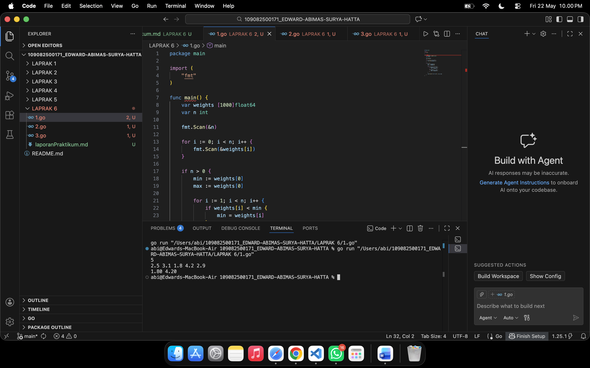
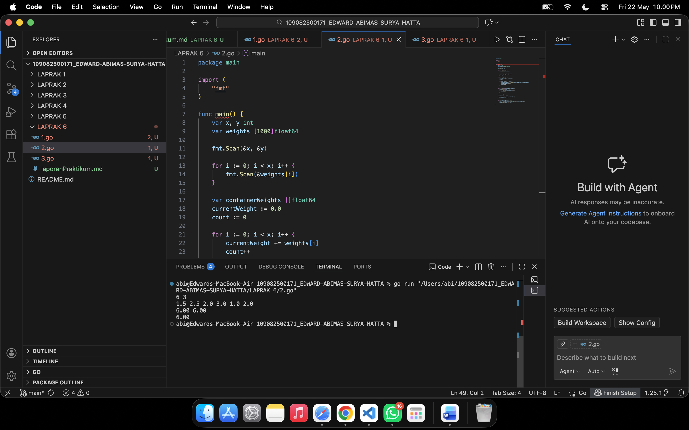
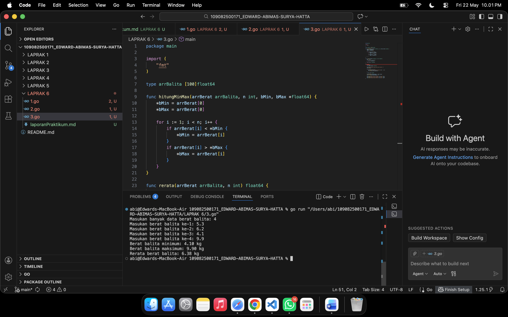

# <h1 align="center">Laporan Praktikum Modul 10 - Pencarian Nilai Max/Min </h1>
<p align="center">EDWARD ABIMAS SURYA HATTA - 109082500171</p>

## Unguided 

### 1. Terdapat sebuah program yang digunakan untuk mendata berat anak kelinci yang akan dijual ke pasar. Program ini menggunakan array dengan kapasitas 1000 untuk menampung data berat anak kelinci tersebut. Untuk masukannya, program menerima sekumpulan bilangan di mana bilangan pertama adalah bilangan bulat N yang menyatakan banyaknya anak kelinci yang ditimbang, lalu diikuti oleh N bilangan riil yang merupakan berat dari masing-masing anak kelinci. Hasil keluaran dari program ini harus berupa dua buah bilangan riil yang masing-masing menyatakan berat kelinci paling kecil dan paling besar.
#### soal1.go

```go
package main

import (
	"fmt"
)

func main() {
	var weights [1000]float64
	var n int

	fmt.Scan(&n)

	for i := 0; i < n; i++ {
		fmt.Scan(&weights[i])
	}

	if n > 0 {
		min := weights[0]
		max := weights[0]

		for i := 1; i < n; i++ {
			if weights[i] < min {
				min = weights[i]
			}
			if weights[i] > max {
				max = weights[i]
			}
		}

		fmt.Printf("%.2f %.2f\n", min, max)
	}
}
```
### Output Unguided :

##### Output 

Program ini dibangun untuk menyelesaikan masalah pencarian data ekstrim berupa berat anak kelinci paling kecil dan paling besar yang akan dijual ke pasar menggunakan pendekatan sekuensial pada array statis. Pada fase awal deklarasi, kita mendefinisikan sebuah wadah penyimpanan memori array berkapasitas maksimal seribu elemen bertipe data desimal guna menampung rincian berat kelinci. Program lalu menginisiasi interaksi dengan meminta pengguna memasukkan sebuah bilangan bulat utama yang bertindak sebagai batas maksimal iterasi atau jumlah anak kelinci yang datanya akan diproses. Setelah kuantitas kelinci teridentifikasi, program memanfaatkan perulangan sistematis untuk membaca serta menyuntikkan setiap angka berat kelinci ke dalam indeks array secara berurutan. Setelah fase pengumpulan data di memori selesai, mesin pencarian mulai berjalan dengan mematok data pada indeks ke nol sebagai asumsi awal untuk nilai minimum sekaligus maksimum sementara. Selanjutnya, algoritma menerjunkan diri ke dalam perulangan kedua yang menelusuri keseluruhan array mulai dari indeks pertama hingga akhir guna mengomparasi setiap elemen secara konstan dengan kedua nilai sementara tersebut. Melalui seleksi kondisi bercabang di dalamnya, apabila mesin mendeteksi angka yang jauh lebih rendah, maka variabel penampung batas bawah akan digantikan nilainya, dan perlakuan serupa diterapkan apabila ditemukan angka yang jauh melampaui batas atas. Pada garis akhir eksekusinya, program mencetak dua angka desimal berdampingan dengan presisi dua angka di belakang koma yang masing-masing secara akurat merepresentasikan kelinci teringan dan terberat dari seluruh populasi sampel.

### 2. Program dibuat untuk menentukan tarif ikan yang akan dijual ke pasar. Program menggunakan array berkapasitas 1000 untuk menyimpan data berat ikan. Masukannya terdiri dari dua baris, yaitu baris pertama berupa dua bilangan bulat x dan y yang masing-masing menyatakan jumlah ikan yang dijual dan batas kapasitas ikan di dalam satu wadah. Baris kedua berisi sejumlah x bilangan riil yang mewakili berat dari tiap ikan. Output yang diminta juga terdiri dari dua baris, di mana baris pertama menampilkan kumpulan bilangan riil dari total berat ikan di setiap wadah secara berurutan, dan baris kedua menampilkan sebuah bilangan riil yang merepresentasikan berat rata-rata ikan dari keseluruhan wadah tersebut.
#### soal2.go

```go
package main

import (
	"fmt"
)

func main() {
	var x, y int
	var weights [1000]float64

	fmt.Scan(&x, &y)

	for i := 0; i < x; i++ {
		fmt.Scan(&weights[i])
	}

	var containerWeights []float64
	currentWeight := 0.0
	count := 0

	for i := 0; i < x; i++ {
		currentWeight += weights[i]
		count++

		if count == y || i == x-1 {
			containerWeights = append(containerWeights, currentWeight)
			currentWeight = 0.0
			count = 0
		}
	}

	for i, w := range containerWeights {
		fmt.Printf("%.2f", w)
		if i < len(containerWeights)-1 {
			fmt.Print(" ")
		}
	}
	fmt.Println()

	totalAllWeight := 0.0
	for _, w := range containerWeights {
		totalAllWeight += w
	}
	
	if len(containerWeights) > 0 {
		avg := totalAllWeight / float64(len(containerWeights))
		fmt.Printf("%.2f\n", avg)
	}
}
```
### Output Unguided :

##### Output 

Penyelesaian skenario algoritma ini difokuskan pada pengelolaan akumulasi bobot objek fisik yang disimulasikan melalui pengisian terstruktur memori array untuk menghitung beban wadah ikan bertahap. Di tahap persiapan, program menuntut masukan dua instrumen pembatas dari pengguna, yakni batas keseluruhan jumlah ikan yang akan dikelola serta batas kapasitas muat maksimal dari masing-masing wadah penampung. Selepas variabel penentu batasan tersebut terekam, program menjalankan perulangan untuk menelan deretan input angka desimal yang mencerminkan beban berat tiap-tiap ikan lalu mengurungnya ke dalam indeks array secara kronologis. Inti pemrosesannya berpusat pada siklus penelusuran kedua yang secara konstan menambahkan berat ikan tunggal ke dalam variabel agregator bobot wadah berjalan sambil mencatat jumlah ikan yang masuk. Seketika ambang batas kapasitas wadah tersentuh, atau bilamana mesin mendapati bahwa perulangan telah berpapasan dengan ikan di ujung ekor data, mesin akan serta-merta mengekstrak total agregator bobot tersebut untuk dicetak ke dalam iring-iringan array wadah baru sembari mereset pengukur kapasitasnya menjadi nol. Menjelang penutupan program, jajaran total berat dari tiap wadah fisik yang sukses terbentuk tersebut dibentangkan pada satu baris keluaran secara mendatar. Tidak berhenti di sana, program turut menyedot seluruh hasil berat komulatif wadah tadi, mengalkulasi penjumlahannya, lantas membaginya dengan total kepingan wadah yang dihasilkan untuk menyajikan luaran pelengkap berupa informasi rasio rata-rata beban pada baris terbawah.

### 3. Disimulasikan sebuah pencatatan data berat balita dalam satuan kilogram di Pos Pelayanan Terpadu atau posyandu. Petugas diminta memasukkan data berat tersebut ke dalam sebuah array untuk kemudian dicari nilai berat paling kecil, paling besar, serta rata-ratanya. Program ini wajib dibuat menggunakan spesifikasi subprogram terpisah. Subprogram pertama adalah prosedur yang menggunakan parameter pointer untuk menghitung berat minimum dan maksimum balita dari array yang didefinisikan. Subprogram kedua adalah sebuah fungsi yang bertugas khusus untuk menghitung dan mengembalikan nilai rerata dari berat balita yang ada di dalam array tersebut.
#### soal3.go

```go
package main

import (
	"fmt"
)

type arrBalita [100]float64

func hitungMinMax(arrBerat arrBalita, n int, bMin, bMax *float64) {
	*bMin = arrBerat[0]
	*bMax = arrBerat[0]

	for i := 1; i < n; i++ {
		if arrBerat[i] < *bMin {
			*bMin = arrBerat[i]
		}
		if arrBerat[i] > *bMax {
			*bMax = arrBerat[i]
		}
	}
}

func rerata(arrBerat arrBalita, n int) float64 {
	sum := 0.0
	for i := 0; i < n; i++ {
		sum += arrBerat[i]
	}
	return sum / float64(n)
}

func main() {
	var n int
	var arrBalitaInput arrBalita

	fmt.Print("Masukan banyak data berat balita: ")
	fmt.Scan(&n)

	for i := 0; i < n; i++ {
		fmt.Printf("Masukan berat balita ke-%d: ", i+1)
		fmt.Scan(&arrBalitaInput[i])
	}

	var min, max float64

	hitungMinMax(arrBalitaInput, n, &min, &max)
	rata := rerata(arrBalitaInput, n)

	fmt.Printf("Berat balita minimum: %.2f kg\n", min)
	fmt.Printf("Berat balita maksimum: %.2f kg\n", max)
	fmt.Printf("Rerata berat balita: %.2f kg\n", rata)
}
```
### Output Unguided :

##### Output 

Struktur perancangan program pencatatan posyandu ini sangat mendewakan kemurnian konsep modularitas dengan cara mendistribusikan beban kerja pemrosesan dari program utama ke serangkaian prosedur dan fungsi pembantu yang terikat pada tipe data kustom. Landasan dari struktur ini adalah perakitan tipe bentukan berupa array dengan daya tampung seratus bilangan desimal yang sepenuhnya dirancang untuk menahan beban data balita yang disodorkan. Dalam urusan memindai ekstrimitas angka, diimplementasikan prosedur yang mengadopsi mekanisme transmisi variabel via alamat memori menggunakan perantara penunjuk pointer. Strategi pointer ini memastikan mesin tidak lagi direpotkan untuk membongkar muat atau mengembalikan dua nilai sekaligus kepada fungsi pemanggil, melainkan setiap deteksi angka yang terlampau mini maupun maksimal di dalam siklus pencariannya akan seketika diinjeksikan secara brutal kepada variabel induknya di alam memori utama. Secara berdampingan, terdapat satu modul fungsional yang bergerak otonom untuk sekadar membajak isi memori array dari hulu ke hilir dengan tujuan memanen setiap entitas bilangan riil untuk kemudian diakumulasikan dan dikonversikan menjadi rasio nilai tengah dengan pembagian linier. Pada gelanggang eksekusi utama, program memberikan ruang bernapas bagi pengguna untuk menyetorkan informasi skala balita beserta rentetan beban berat dari tiap individu tersebut. Pasca penerimaan input berakhir, mesin tinggal memanggil paksa prosedur bedah pencarian ekstrim dan modul perhitungan rata-rata, lalu menyuguhkan temuan statistika paripurna tersebut ke bentang layar dengan pelabelan yang rapi dan seragam.
